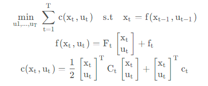
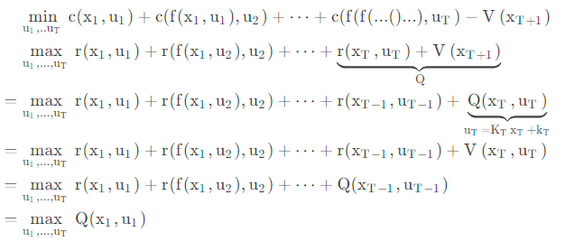

# LQR动规解法及延申 

## 1. LQR动规解法

### 1.1 LQR问题定义：
1. 动态模型是确定性的：$x_{k+1} = Ax_k + Bu_k$。
2. 代价函数是已知的。$c(x_t,u_t)$给定状态/控制量，值为标量 
3. LQR目的：给定一个初始状态$x_0$，目标状态$x_N$，找到一个最优的控制序列$u_0,u_1,...,u_{N-1}$，使得累计cost最小。
4. LQR的近似：linear对$f(x_t,u_t)$采用一阶线性近似，quadratic对$c(x_t,u_t)$采用二阶近似。

LQR:

### 1.2 LQR问题的求解：
已知量：
    - 初始状态: $x_0$；
    - 目标状态: $x_N$；
    - 动态模型: $x_{k+1} = Ax_k + Bu_k$；
    - cost函数的结构参数: $c(x_t,u_t) =\frac{1}{2} \begin{bmatrix} x_t \\ u_t \end{bmatrix}^T C_t \begin{bmatrix} x_t \\ u_t \end{bmatrix}+ \begin{bmatrix} x_t \\ u_t \end{bmatrix}c_t$；

### 1.3 推导过程

动规求解，逐步反向求出最优控制序列。
正向推导最优控制序列对应的状态序列。

#### 1.3.1 BackWard Pass
1. $V_N(x_N) = 0$；
2. $V_k(x_k) = \min_{u_k} \{c(x_k,u_k) + V_{k+1}(x_{k+1})\}$；
3. 因此，对上式u求导，可以获得最优的$V_k(x_k)$对应的$u_k$。
首先从尾部前推，即第n-1步的最优控制量：
式中，$C_t=\begin{bmatrix} C_{xx} & C_{xu} \\ C_{ux} & C_{uu} \end{bmatrix},c_t=\begin{bmatrix} D_x \\ D_u \end{bmatrix}$需要根据具体问题给定。
$$
\begin{aligned}
Q_k(x_k,u_k) &=\frac{1}{2} \begin{bmatrix} x_k \\ u_k \end{bmatrix}^T C_k \begin{bmatrix} x_k \\ u_k \end{bmatrix}+ \begin{bmatrix} x_k \\ u_k \end{bmatrix}^T c_k \\
\Delta Q_k(x_k,u_k) / \Delta u_k &= C_{uu}u^* + C_{ux} x_k + D_u  \\
u^* &= C_{uu}^{-1}(-C_{ux} x_k - D_u) \\ &= K_kx_k + k_k \\
K_k &= -C_{uu}^{-1}C_{ux}, K_k = -C_{uu}^{-1}D_u \\  
\end{aligned}
$$
将最优控制量带入$V_k(x_k)$中，得到$V_k(x_k)$的表达式：
$$
\begin{aligned}
V_k(x_k) &= \frac{1}{2} \begin{bmatrix} x_k \\K_kx_k + k_k \end{bmatrix}^T C_k \begin{bmatrix} x_k \\ K_kx_k + k_k \end{bmatrix}+ \begin{bmatrix} x_k \\ K_kx_k + k_k \end{bmatrix}^T D_k \\
&= \frac{1}{2}(
\begin{bmatrix} 1 \\ K_k \end{bmatrix}x_k + \begin{bmatrix} 0 \\ k_k \end{bmatrix})^T
\begin{bmatrix} C_{xx} & C_{xu} \\ C_{ux} & C_{uu} \end{bmatrix} 
(\begin{bmatrix} 1 \\ K_k \end{bmatrix}x_k + \begin{bmatrix} 0 \\ k_k \end{bmatrix}) + 
(\begin{bmatrix} 1 \\ K_k \end{bmatrix}x_k + \begin{bmatrix} 0 \\ k_k \end{bmatrix})^T 
\begin{bmatrix} D_x \\ D_u \end{bmatrix} \\
&= \frac{1}{2}(x_k^T (C_{xx} + K_k^TC_{ux} + C_{xu}K_k + K_k^TC_{uu}K_k)x_k + x_k^T(C_{xu}k_k + K_k^TC_{uu}k_k) + (k_kC_{ux} + k_k^TC_{uu}K_k)x_k + k_k^TC_{uu}k_k) + x_k^T(D_x + K_k^T D_u) + k_k^T D_u \\
&= \frac{1}{2}\{x_k^T(C_{xx} +K_k^TC_{ux} + C_{xu}K_k + K_k^TC_{uu}K_k)x_k\} + \{x_k^T(C_{xu}k_k + K_k^TC_{uu}k_k + D_x + K_k^T D_u)\} + \{k_k^TD_u + \frac{1}{2}k_k^TC_{uu}k_k\} \\
V^{new}_{xx} &=C_{xx} +K_k^TC_{ux} + C_{xu}K_k + K_k^TC_{uu}K_k \\ 
v^{new}_{x} &=C_{xu}k_k + K_k^TC_{uu}k_k + D_x + K_k^T D_u \\
const_k &= k_k^TD_u + \frac{1}{2}k_k^TC_{uu}k_k \\ 
V_{k}(x_k) &= \frac{1}{2}x_k^T V^{new}_{xx} x_k + x_k^T v^{new}_{x} + {const_k}
\end{aligned}
$$
于是，可以得到n-1步的最优控制量$u_{n-1}$和$V_{n-1}(x_{n-1})$。
但是这里获得的结果是终端状态为0时求出的前一个状态，是整个迭代过程中的一个特例，因为V_N(x_N)实际上和状态量无关了，但是，$V_{k}$的形式需要和$x_K$有关，这样才能引入动态方程约束，所以，我们需要继续向前推导。得到一个和状态量相关的V形式。
继续前推一个状态,为了方便，直接写为:$x_{t}$
$$
\begin{aligned}
Q_{x_{t},u_{t}} &= \frac{1}{2} \begin{bmatrix} x_t \\ u_t \end{bmatrix}^T C_t \begin{bmatrix} x_t \\ u_t \end{bmatrix}+ \begin{bmatrix} x_t \\ u_t \end{bmatrix}^T c_t + V_{t+1}(x_{t+1}) \\
&=\frac{1}{2} \begin{bmatrix} x_t \\ u_t \end{bmatrix}^T C_t \begin{bmatrix} x_t \\ u_t \end{bmatrix}+ \begin{bmatrix} x_t \\ u_t \end{bmatrix}^T c_t + \frac{1}{2}x_{t+1}^T V^{new}_{xx} x_{t+1} + x_{t+1}^T v^{new}_{x} + {const_{t+1}} \\
\end{aligned}
$$
式中存在两个状态，$x_{t+1}$和$x_t$，我们需要将$x_{t+1}$用$x_t$表示出来，这样才能得到一个和状态量相关的V形式,$A,B$是线性化后的模型参数，和优化算法无关。$x_{t+1} = Ax_k + B u_k$，带入上式
$$
\begin{aligned}
Q(x_{t},u_{t}) &=\frac{1}{2} \begin{bmatrix} x_t \\ u_t \end{bmatrix}^T C_t \begin{bmatrix} x_t \\ u_t \end{bmatrix}+ \begin{bmatrix} x_t \\ u_t \end{bmatrix}^T c_t + \frac{1}{2}(\begin{bmatrix}A && B \\\end{bmatrix}\begin{bmatrix}x_k \\ u_k\end{bmatrix})^T V^{new}_{xx} (\begin{bmatrix}A && B \\\end{bmatrix}\begin{bmatrix}x_k \\ u_k\end{bmatrix}) + (\begin{bmatrix}A && B \\\end{bmatrix}\begin{bmatrix}x_k \\ u_k\end{bmatrix})^T v^{new}_{x} + {const_{t+1}} \\
&=\frac{1}{2} \begin{bmatrix} x_t \\ u_t \end{bmatrix}^T C_t \begin{bmatrix} x_t \\ u_t \end{bmatrix}+ \begin{bmatrix} x_t \\ u_t \end{bmatrix}^T c_t + \frac{1}{2}\begin{bmatrix}x_k \\ u_k\end{bmatrix}^T \begin{bmatrix} AV_{xx}^{new}A && AV_{xx}^{new}B \\ BV_{xx}^{new}A && BV_{xx}^{new}B \end{bmatrix} \begin{bmatrix}x_k \\ u_k\end{bmatrix} + \begin{bmatrix}x_k \\ u_k\end{bmatrix}^T \begin{bmatrix} Av_{x} \\ Bv_{x} \end{bmatrix} + {const_{t+1}} \\ 
&=\frac{1}{2} \begin{bmatrix} x_t \\ u_t \end{bmatrix}^T \begin{bmatrix} C_{xx,t}AV_{xx}^{new}A && C_{xu,t}AV_{xx}^{new}B \\ C_{ux,t}BV_{xx}^{new}A && C_{uu,t}BV_{xx}^{new}B \end{bmatrix} \begin{bmatrix} x_t \\ u_t \end{bmatrix} + \begin{bmatrix} x_t \\ u_t \end{bmatrix}^T  \begin{bmatrix} D_{x,t} +  Av^{new}_{x} \\ D_{u,t}+Bv^{new}_{x} \end{bmatrix} \\ 
C_{t,new} &= \begin{bmatrix} C_{xx,t}+AV_{xx}^{new}A && C_{xu,t}+AV_{xx}^{new}B \\ C_{ux,t}+BV_{xx}^{new}A && C_{uu,t}+BV_{xx}^{new}B \end{bmatrix} \\
D_{t,new} &= \begin{bmatrix} D_{x,t} +  Av^{new}_{x} \\ D_{u,t}+Bv^{new}_{x} \end{bmatrix} \\
\end{aligned}
$$
上式再次转化为了二次型形式，对控制量求导，
$$
\begin{aligned}
u_t^* &= C_{t,new,uu}^{-1}(-C_{t,new,ux} x_t - D_{t,new,u}) \\ &= K_tx_t + k_t \\
K_t &= -C_{t,new,uu}^{-1}C_{t,new,ux}, k_t = -C_{t,new,uu}^{-1}D_{t,new,u} \\ 
\end{aligned}
$$
将最优控制量带入$V_t(x_t)$中，得到正常迭代过程中$V_t(x_t)$的表达式：
$$
\begin{aligned}
V_t(x_t) &= \frac{1}{2} \begin{bmatrix} x_t \\K_tx_t + k_t \end{bmatrix}^T C_{t,new} \begin{bmatrix} x_t \\ K_tx_t + k_t \end{bmatrix}+ \begin{bmatrix} x_t \\ K_tx_t + k_t \end{bmatrix}^T D_{t,new}+ const_{t+1} \\
&= \frac{1}{2} (
\begin{bmatrix} 1 \\ K_k \end{bmatrix}x_k + \begin{bmatrix} 0 \\ k_k \end{bmatrix})^T C_{t,new} (
\begin{bmatrix} 1 \\ K_k \end{bmatrix}x_k + \begin{bmatrix} 0 \\ k_k \end{bmatrix})+ (
\begin{bmatrix} 1 \\ K_k \end{bmatrix}x_k + \begin{bmatrix} 0 \\ k_k \end{bmatrix})^T D_{t,new}+ const_{t+1} \\
&= \frac{1}{2}(x_t^T (C_{xx} + K_t^TC_{ux} + C_{xu}K_t + K_t^TC_{uu}K_t)x_k + x_t^T(C_{xu}k_t + K_t^TC_{uu}k_t) + (k_tC_{ux} + k_t^TC_{uu}K_t)x_t + k_t^TC_{uu}k_t) + x_t^T(D_x + K_t^T D_u) + k_t^T D_u \\
&= \frac{1}{2}\{x_t^T(C_{xx} +K_t^TC_{ux} + C_{xu}K_t + K_t^TC_{uu}K_t)x_t\} + \{x_t^T(C_{xu}k_t + K_t^TC_{uu}k_t + D_x + K_t^T D_u)\} + \{k_t^TD_u + \frac{1}{2}k_t^TC_{uu}k_t\} \\
V^{new}_{xx} &=C_{xx} +K_t^TC_{ux} + C_{xu}K_t + K_t^TC_{uu}K_t \\ 
v^{new}_{x} &=C_{xu}k_t + K_t^TC_{uu}k_t + D_x + K_t^T D_u \\
const_t &= k_t^TD_u + \frac{1}{2}k_t^TC_{uu}k_t + const_{t+1} \\ 
V_{t}(x_t) &= \frac{1}{2}x_t^T V^{new}_{xx} x_t + x_t^T v^{new}_{x} + {const_{t+1}}
\end{aligned}
$$

总结推导过程，算法描述如下：

$$
\begin{aligned}
&\text{Initialization:} \\
&\quad V_N(x_N) = 0 \\
&\quad C_{xx}= Q_{xx}\\
&\quad C_{xu}=Q_{xu} \\
&\quad C_{ux}=Q_{ux}\\
&\quad C_{uu}=Q_{uu} \\
&\quad D_x=q_{x} \\
&\quad D_u=q_{u} \\
&\quad V_{xx} = C_{xx} \\
&\quad V_x = D_x \\
&\quad const_N = 0 \\
&\text{for } k = N-1 \text{ to } 0 \text{ do} \\
&\quad K_k = -C_{uu}^{-1}C_{ux} \\
&\quad k_k = -C_{uu}^{-1}D_u \\
&\quad V_{xx} =V_{xx} +K_k^TC_{ux} + C_{xu}K_k + K_k^TC_{uu}K_k \\
&\quad V_{x} =V_x + C_{xu}k_k + K_k^TC_{uu}k_k + K_k^T D_u \\
&\quad const_k = k_k^TD_u + \frac{1}{2}k_k^TC_{uu}k_k + const_{k+1} \\
&\quad C_{xx} = Q_{xx,t}+AV_{xx}^{new}A\\
&\quad C_{xu} = Q_{xu,t}+AV_{xx}^{new}B\\
&\quad C_{ux} = Q_{ux,t}+BV_{xx}^{new}A\\
&\quad C_{uu} = Q_{uu,t}+BV_{xx}^{new}B\\
&\quad D_x = q_{x,t} +  Av^{new}_{x} \\
&\quad D_u = q_{u,t}+Bv^{new}_{x} \\
&\quad V_{k}(x_k) = \frac{1}{2}x_k^T C_{xx} x_k + x_k^T D_{x} + {const_k} \\
&\text{end for}
\end{aligned}
$$

后续沿着过程继续前向推导，直到达到 $x_0$，得到最优控制序列。

#### 1.3.2 Forward Pass
1. $u_{k}=K_kx_k + k_k$;
2. $x_{k+1} = Ax_k + Bu_k$；

#### 1.3.2 求解

1. 通过上述过程，可以求解出最优控制序列$u_0,u_1,...,u_{N-1}$；
2. 通过Forward Pass，可以求解出最优状态序列$x_0,x_1,...,x_{N}$；
3. 结束

通过反馈生成最优控制量，通过前馈生成最优状态量，完成LQR问题的求解。

## 2. ILQR问题

### 2.1 ILQR问题定义：

相比于LQR问题，模型的比较如下：
$$
\begin{aligned}
f(x_k,u_k) &= F_t \begin{bmatrix}x_t\\ u_t\end{bmatrix}, LQR \\
c(x_t,u_t) &= \frac{1}{2} \begin{bmatrix}x_t\\ u_t\end{bmatrix}^T Q_t \begin{bmatrix}x_t\\ u_t\end{bmatrix} + \begin{bmatrix}x_t\\ u_t\end{bmatrix}^T q_t, LQR \\
\\
f(x_t,u_t) &\approx f(x_r,u_r) + \,\nabla_{x_r,u_r}f(x_r,x_r) \begin{bmatrix}x_t - x_r\\ u_t-u_r\end{bmatrix}, ILQR \\
c(x_t,u_t) &\approx c(x_r,u_r) + \,\nabla_{x_r,u_r}c(x_r,x_r) \begin{bmatrix}x_t - x_r\\ u_t-u_r\end{bmatrix} + \frac{1}{2} \begin{bmatrix}x_t - x_r\\ u_t-u_r\end{bmatrix}^T \nabla^2_{x_r,u_r}f(x_r,u_r) \begin{bmatrix}x_t - x_r\\ u_t-u_r\end{bmatrix}, ILQR \\
\end{aligned}
$$
对运动学模型来说，因为通常都是误差形式，所以天然满足LQR OR ILQR对于动力学模型的形式要求，但实际使用时，不可混合理解，对LQR来说，状态量为:$x_t, u_t$, 对ILQR来说，误差形式是在建优化问题时构建的，状态量为$x_t-x_r, u_t-x_r$。

*直观点理解就是：LQR只要求线性模型，ILQR必须使用误差模型；从代价的角度，LQR描述的是最小代价，ILQR描述的是代价的增量最小。*

ILQR问题定义：
1. 动态模型是非线性的，使用误差模型近似(线性,引入ref，如果模型已经是误差形式，可以直接使用，误差形式的目的是引入参考):
$$
\begin{aligned}
f(x_t,u_t) &\approx f(x_r,u_r) + \nabla_{x_r,u_r}f(x_r,x_r) \begin{bmatrix}x_t - x_r\\ u_t-u_r\end{bmatrix} \\
f(x_t,u_t) - f(x_r,u_r) &= \nabla_{x_r,u_r}f(x_r,x_r) \begin{bmatrix}x_t - x_r\\ u_t-u_r\end{bmatrix} \\ 
&\quad \text{构建误差模型新的状态量}:\hat{x}_t = x_t - x_r, \hat{u}_t = u_t - u_r \\
f(\hat{x}_t,\hat{u}_t) &= \nabla_{x_r,u_r}f(x_r,x_r) \begin{bmatrix}\hat{x}_t\\ \hat{u}_t\end{bmatrix} \\
&\quad \text{误差模型:} \dot{\hat{x}} = f(\hat{x},\hat{u}) \\
&\quad \text{前向欧拉:} A_{x_r,u_r} = \nabla_{x_r}f(x_r,x_r), B_{x_r,u_r} =\nabla_{u_r}f(x_r,u_r) \\
\hat{x}_{t+1}&= (I + A_{x_r,u_r}\Delta t)\hat{x}_t +  B_{x_r,u_r}\hat{u}_t\Delta t \\
&\quad \text{模型参数：} \hat{A} = I + A_{x_r,u_r}\Delta t, \hat{B} = B_{x_r,u_r}\Delta t \\
&\quad \text{误差模型表示：} \hat{x}_{t+1}=\hat{A}x_t + \hat{B}u_t \\
\end{aligned}
$$
2. 代价函数转变为代价增量函数，使用二阶近似，式中求解需要确定非线性代价$c(x_t,y_t)$的一阶、二阶导数。
$$
\begin{aligned}
c(x_t,u_t) &\approx c(x_r,u_r) + \nabla_{x_r,u_r}c(x_r,x_r) \begin{bmatrix}x_t - x_r\\ u_t-u_r\end{bmatrix} + \frac{1}{2} \begin{bmatrix}x_t - x_r\\ u_t-u_r\end{bmatrix}^T \nabla^2_{x_r,u_r}f(x_r,u_r) \begin{bmatrix}x_t - x_r\\ u_t-u_r\end{bmatrix} \\
&\quad \text{化简替换误差模型状态量，表示相对于参考的变化量}:\\
c(\hat{x_t},\hat{u_t}) &= \nabla_{x_r,u_r}c(x_r,x_r) \begin{bmatrix}\hat{x_t} \\ \hat{u_t}\end{bmatrix} + \frac{1}{2} \begin{bmatrix}\hat{x_t}\\ \hat{u_t}\end{bmatrix}^T  \nabla^2_{x_r,u_r}c(x_r,u_r) \begin{bmatrix}\hat{x_t} \\ \hat{u_t} \end{bmatrix} \\
\end{aligned}
$$
3. 代价函数$c(x_t,y_t)$的设定可以更为随意，跟贴合实际约束，不再受到一定要二次型的限制。可以自由增加一些非线性约束项。
4. ILQR目的：给定一个参考序列$x$，找到一个最优的控制序列$u_0,u_1,...,u_{N-1}$，使得满足约束的情况下，cost增量最小。

### 2.2 ILQR问题的求解：

相比于LQR的迭代求解，问题的区别在于，
$$
\begin{aligned}
F_t &= \nabla_{x_r,u_r}f(x_r,x_r) \\
Q_t &= \Delta_{x_r,u_r}c(x_r,x_r) \\
c_t &= \nabla_{x_r,u_r}c(x_r,x_r) \\   
\end{aligned}
$$
基于上面式子的替换，于是，ILQR的求解也可以完全沿用LQR的求解过程，只是在计算$Q_t$和$c_t$时，需要对非线性代价函数进行一阶、二阶求导替换，注意，因为是对参考点做代价生成，所以，每个推演步都需要对参考点进行计算。

Q:完成一次迭代后，参考点、展开点都需要更新

注释：

展开点：指生成A,B矩阵时用到的点，这里
    - 选择优化轨迹作为展开点：因为误差模型，下一个轨迹是依托当前轨迹生成的，A,B衡量的就是从对应点转移到对应点，所以，选择优化轨迹作为展开点，是最合适的。
    - 选择参考轨迹作为展开点：前期误差会很大，后续感觉上也会逐步收敛，但是，因为误差模型单步误差的累计，误差可能会越来越大。<不确定>
参考点(期望)：期望是和参考轨迹最贴切的，但是参考轨迹会逐步更新，期望则可以依需求给定，例如，期望U = 0，也是没问题的，但是，期望点的选择会影响最终的收敛速度和结果。
